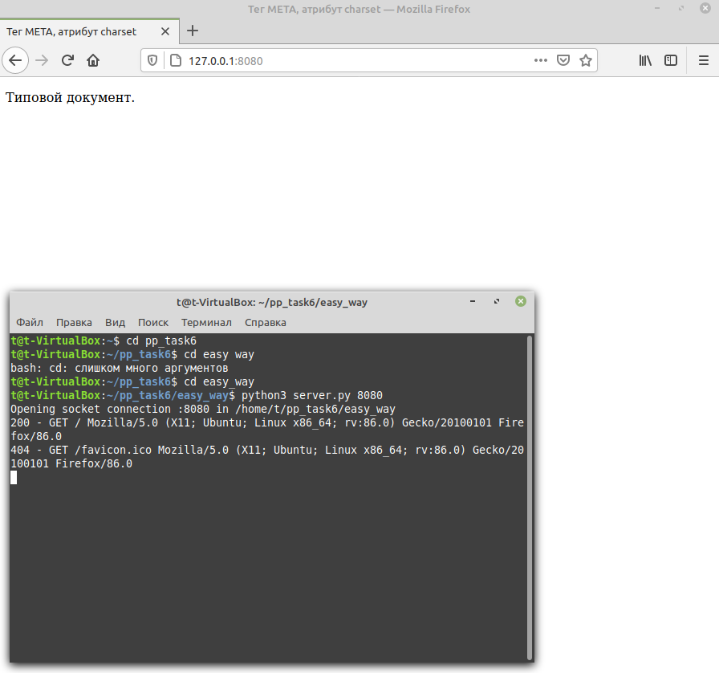
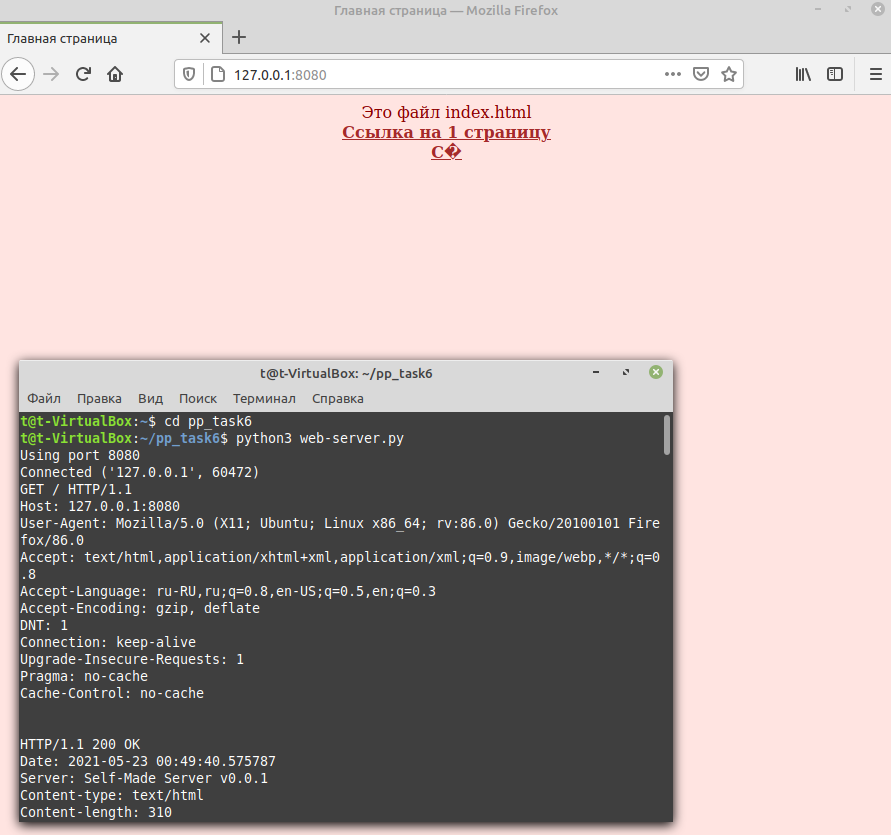
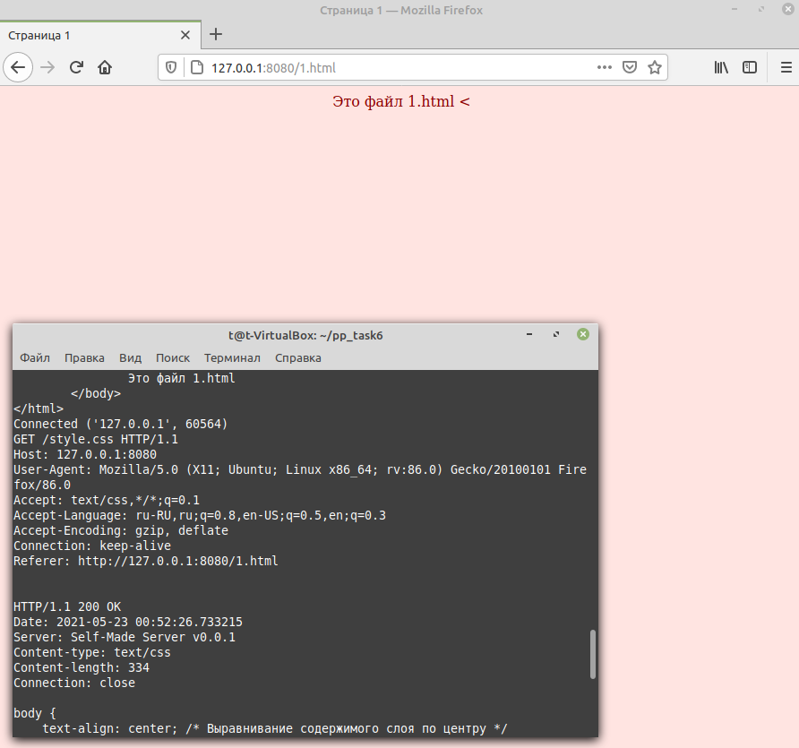
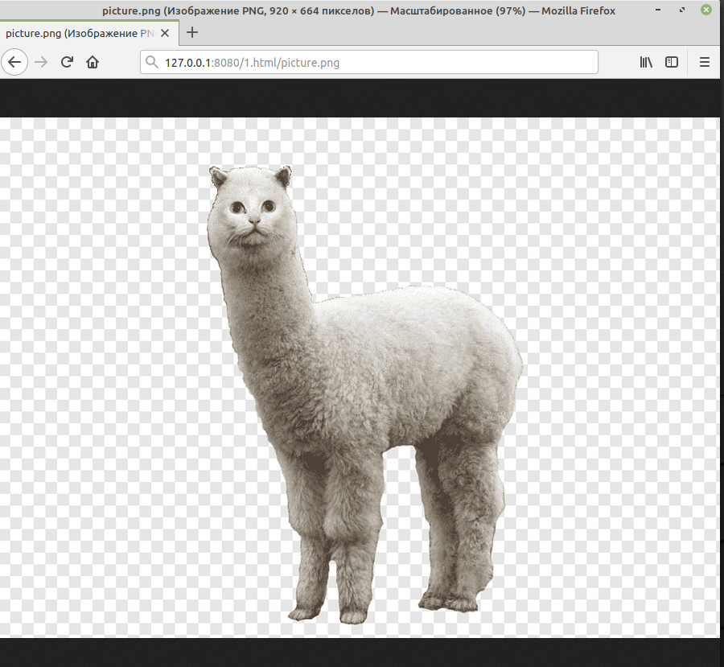
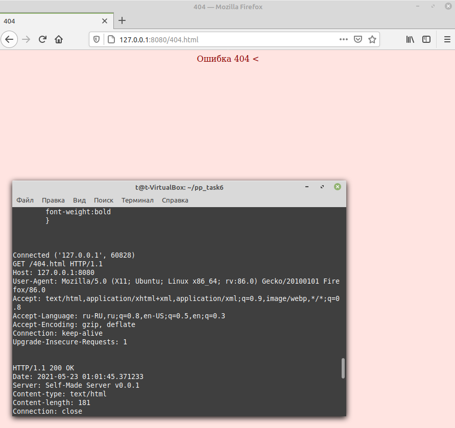
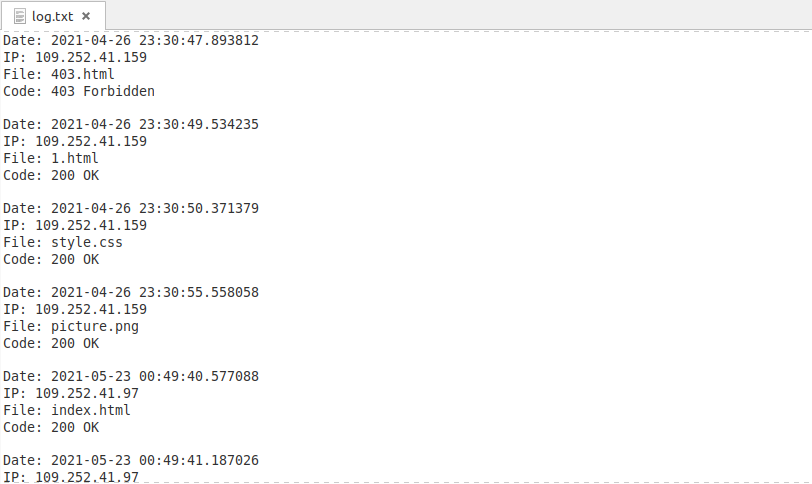

## Низкоуровневая работа с веб

### Задания для выполнения

1. Написать простейший веб-сервер. Сервер должен принимать входящие соединения на порту 80 и отдавать пользователю содержимое запрошенного ресурса из определенной директории (рабочей директории сервера).
2. Разместите в рабочей директории сервера простой веб сайт, содержащий страницу index.html. Убедитесь, что при подключении к серверу, если не указан необходимый ресурс он отдает содержимое страницы index.html.
3. Познакомьтесь со спецификацией протокола HTTP. Узнайте, в каком формате клиент посылает запрос серверу и в каком формате сервер посылает ответ клиенту. Особое внимание уделите полям заголовка.
4. Сделайте так, чтобы к вашему серверу можно было обращаться по протоколу HTTP. Для этого не нужно реализовывать поддержку всех возможных нюансов, вам нужно лишь описать общий формат запросов и ответов и поддерживать некоторые поля заголовков.
5. Проверьте работу вашего сервера, обратившись к нему из адресной строки любого браузера. Для этого достаточно написать в ней адрес хоста, на котором работает сервер (localhost тоже подходит). Вы должны увидеть содержимое (не код) вашей страницы. 

Простейший веб-сервер (в папке easy_way, запуск сервера python3 server.py 8080, обращение к серверу из браузера http://127.0.0.1:8080)

### Дополнительные задания

1. При ответе вашего сервера посылайте некоторые основные заголовки:
    1. Date
    2. Content-type
    3. Server
    4. Content-length
    5. Connection: close.
2. Создайте файл настроек вашего веб-сервера, в котором можно задать прослушиваемый порт, рабочую директорию, максимальный объем запроса в байтах. Можете добавить собственные настройки по желанию. -> settings.txt
3. Если файл не найден, сервер передает в сокет специальный код ошибки - 404. -> 404.html
4. Сервер должен работать в многопоточном режиме. 
5. Сервер должен вести логи в следующем формате: Дата запроса. IP-адрес клиента, имя запрошенного файла, код ошибки. -> log.txt
6. Добавьте возможность запрашивать только определенные типы файлов (.html, .css, .js и так далее). При запросе неразрешенного типа, верните ошибку 403. -> 403.html
7. Реализуйте поддержку постоянного соединения с несколькими запросами.
8. Реализуйте поддержку бинарных типов данных, в частночти, картинок.

1. index.html - начальная страничка
2. 1.html - другая страничка, которая открывается с основной странички
3. 403.html, 404.html - странички ошибок
4. log.txt - файл логов
5. picture.png - картинка, которая открывается с основной странички
6. settings - файл настроек сервера
7. web-server - основной файл запуска сервера
8. запуск сервера python3 web-server.py, обращение к серверу из браузера http://127.0.0.1:8080

начальная страничка:

доп. страничка

страничка картинки

ошибка 404

часть log файла

